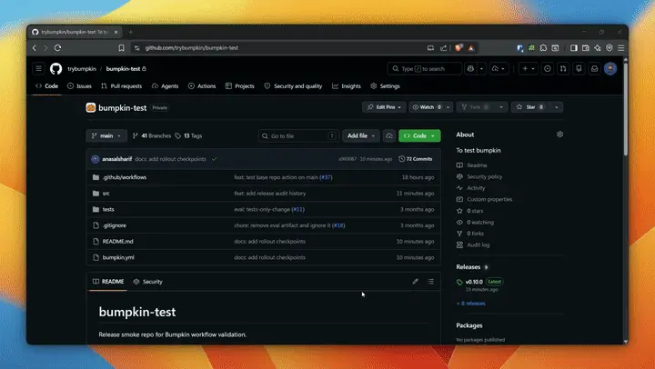
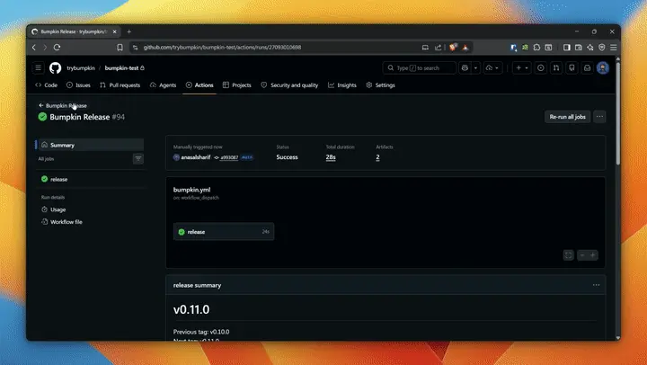

# Bumpkin


Bumpkin is a GitHub Action that turns merged PR batches into a reviewed release candidate with a proposed version bump and publishable release notes.

It is built for teams that want release automation without depending on perfect commit conventions.

## Demo

### Preview



### Publish



## What it does

1. Finds the previous tag
2. Scans merged PRs since that tag
3. Proposes the next version or `NO_BUMP`
4. Builds a maintainer briefing plus a public changelog
5. Publishes only the reviewed public release when you choose `release_publish`

## Who it is for

- Teams publishing GitHub Releases from merged PRs
- Squash-merge or mixed-merge workflows
- Repos with inconsistent commit discipline
- Maintainers who want review before publish

## Setup

Install Bumpkin as a GitHub Action directly from this repository:

- `uses: trybumpkin/bumpkin@v1`

Before you run it:

- Add these repository secrets:
  - `MODELS_TOKEN`
  - `BUMPKIN_MODEL`
  - `BUMPKIN_MODELS_ENDPOINT`
- Give the workflow:
  - `actions: read`
  - `contents: write`
  - `pull-requests: read`

Example secret values:

```text
MODELS_TOKEN=your_provider_token
BUMPKIN_MODEL=gemini-2.5-flash
BUMPKIN_MODELS_ENDPOINT=https://generativelanguage.googleapis.com/v1beta/openai/
```

## First run checklist

- Add `MODELS_TOKEN`, `BUMPKIN_MODEL`, and `BUMPKIN_MODELS_ENDPOINT`
- Keep `actions: read`, `contents: write`, and `pull-requests: read`
- Run `release_preview` first
- Review the maintainer briefing, candidate artifact, and summary
- Run `release_publish` only after the preview looks right

## Quickstart

```yaml
name: Bumpkin Release
run-name: ${{ inputs.operation == 'release_publish' && 'Bumpkin Publish' || 'Bumpkin Preview' }}

on:
  workflow_dispatch:
    inputs:
      operation:
        description: "What should Bumpkin do?"
        required: true
        default: "release_preview"
        type: choice
        options:
          - release_preview
          - release_publish
      base_tag:
        description: "Optional previous tag override"
        required: false
        default: ""
      preview_run_id:
        description: "Optional preview workflow run id to publish from"
        required: false
        default: ""

permissions:
  actions: read
  contents: write
  pull-requests: read

jobs:
  bumpkin:
    runs-on: ubuntu-latest
    steps:
      - uses: actions/checkout@v4
        with:
          fetch-depth: 0

      - id: bumpkin
        uses: trybumpkin/bumpkin@v1
        with:
          operation: ${{ inputs.operation }}
          base_tag: ${{ inputs.base_tag }}
          preview_run_id: ${{ inputs.preview_run_id }}
          model: ${{ secrets.BUMPKIN_MODEL }}
          fallback_model: ${{ secrets.BUMPKIN_FALLBACK_MODEL || '' }}
          models_endpoint: ${{ secrets.BUMPKIN_MODELS_ENDPOINT }}
          models_token: ${{ secrets.MODELS_TOKEN }}
          request_timeout: "45"
          model_call_min_interval_ms: "4000"

      - uses: actions/upload-artifact@v4
        with:
          name: bumpkin-release-notes
          path: ${{ steps.bumpkin.outputs.release_notes_path }}

      - uses: actions/upload-artifact@v4
        with:
          name: ${{ steps.bumpkin.outputs.release_candidate_artifact_name }}
          path: ${{ steps.bumpkin.outputs.release_candidate_path }}
```

## What you get back

For each release run, Bumpkin returns:

- The previous tag
- The proposed next tag
- The release type
- The included PR count
- A preview artifact that includes `Release rationale`, versioning context, key evidence, and the final public changelog
- A release candidate artifact that `release_publish` can verify and reuse
- A public release body that only contains changelog sections when a release is published

## Release workflow

- `release_preview` builds a maintainer briefing plus a release candidate artifact without publishing.
- `release_publish` verifies a saved preview candidate and then creates the tag and GitHub Release from the precomputed public changelog.
- `NO_BUMP` means no release is needed.
- `needs_review` means the batch should be reviewed before publishing.

## Why the split matters

- Maintainers review the release decision before anything ships
- Publish reuses the saved candidate instead of asking the model again
- Public releases stay changelog-focused and do not leak maintainer rationale

## Maintainer flow

From the Actions tab:

1. Run `Bumpkin Release`
2. Choose `release_preview`
3. Inspect the maintainer preview artifact, release candidate artifact, and summary
4. Run it again with `release_publish` when the preview looks right
5. Pass `preview_run_id` when you want to publish a specific preview run
6. Use `base_tag` when you want to preview from a specific release boundary

## More

- [ROADMAP.md](ROADMAP.md)
- [CONTRIBUTING.md](CONTRIBUTING.md)
- [SECURITY.md](SECURITY.md)
- [CHANGELOG.md](CHANGELOG.md)
